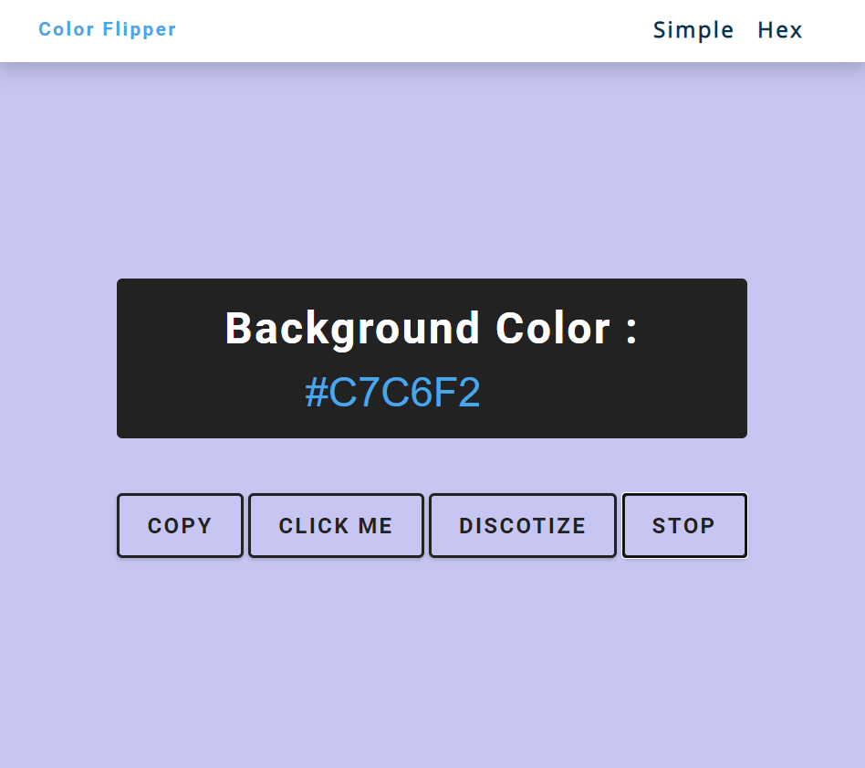

# color-flipper

[Click to see](https://ayerdelen.github.io/color-flipper/hex.html)

- This is a tutorial of [Free Code Camp](https://www.youtube.com/watch?v=3PHXvlpOkf4&list=WL&index=21&t=21s)

## I've learned:
- Generating random numbers and use them
- Create another function to be more functionality
- setInterval() and clearInterval() logic

## I've added:
- Copy button so that the random hex code can be copied.
- Discotize button that changing background color until I stop it with stop button.

